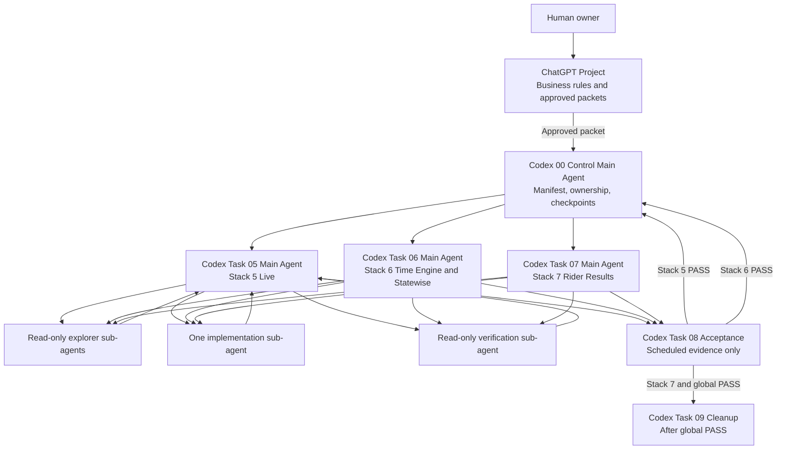

# WEC ChatGPT, Codex, and Sub-Agent Operating Handoff

Date: `2026-07-12`

Source project: RingStatus Horseshowing/WEC

Status: `READY FOR HUMAN REVIEW`

## Purpose

This handoff defines how ChatGPT, Codex main agents, Codex sub-agents, scheduled
acceptance, and durable task state work together while completing the remaining
WEC workflow stacks.

It replaces a flat model where every stage is represented by one long Codex
conversation. Durable stack ownership remains in separate Codex tasks, while
narrow inspection, implementation, and verification work can be delegated to
temporary sub-agents.

This document does not authorize code, Airtable, schema, scheduler, deployment,
or production-data changes.

## Official Product Basis

OpenAI describes the Codex app as a command center for multiple agents, with
separate tasks and built-in worktree support for isolated work. ChatGPT remains
the conversational and decision surface; Codex remains the software-development
surface.

References:

- https://openai.com/index/introducing-the-codex-app/
- https://help.openai.com/en/articles/11369540-using-codex-with-your-chatgpt-plan
- https://help.openai.com/fil-ph/articles/20001275-chatgpt-work-and-codex

## Authority Readback

| Authority | Purpose |
|---|---|
| `chatgpt-codex-operating-package-2026-07-12.md` | Drift mechanism, context gates, lifecycle rules, bounded packets |
| `wec-stack-and-preflight-handoff-2026-07-12.md` | Airtable-presented stack and July 12 preflight proof |
| `wec-current-future-stack-function-inventory-2026-07-12.md` | Current functions mapped to future Stack 5-7 work |
| `wec-current-legacy-workflow-function-inventory-2026-07-12.md` | Complete current legacy function inventory |
| `wec-incomplete-task-completion-prompts-2026-07-12.md` | Bounded Task 05, 06, and 07 prompts |
| `wec-rider-timing-alert-policy.md` | Canonical timing, trigger, Statewise, and rider-result business rules |
| Airtable `hs_endpoints/work_stage` | Human workflow control surface |
| Checked-in code and schema | Implementation evidence |
| Scheduled execution and resulting rows | Operational proof |

If these sources conflict, the agent returns `CONTEXT_FAIL`. It does not select
one silently.

## Current Verified State

### Core Preflight

The outside-lane July 12 preflight passed without production writes:

```text
show_no                    14910
focus_day                  2026-07-12
ring days                  9
schedule rings             9 of 9
schedule rows              114
eligible classes           85
useful raw documents       24
terminal no-match classes  61
parsed documents           24 of 24
tracked entries            37
projected rings            9
projected classes          85
projected entries          37
Step 4 blockers            0
natural gate               runtime_ready
production writes          0
```

Core is outside Tasks 05-07.

### Remaining Stack Status

| Stack | Current status | Evidence boundary | Next gate |
|---|---|---|---|
| Stack 5 Live | `PASS` | Two consecutive scheduler-owned cycles returned HTTP 200; runtime keys remained stable, required live projections populated, duplicate history checks returned zero, and other lanes were not invoked | KEEP; no further Task 05 edits |
| Stack 6 Time Engine and Statewise | `PASS` | Two consecutive scheduler-owned cycles returned HTTP 200; 9/85/37 projections remained intact, Statewise completion receipts were written, and changed Catalyst/Airtable Statewise rows were created | KEEP; no further Task 06 edits |
| Stack 7 Rider Results | `PASS` | Two post-fix scheduler-owned cycles returned HTTP 200; hash stability reached finality, terminal rider results and rider-facing events were created, and duplicate checks returned zero | KEEP; no further Task 07 edits |
| Global workflow | `READY FOR SCHEDULED REVIEW` | Core preflight and Stacks 5-7 have individual PASS evidence | Verify the combined active workflow without edits or manual substitutes |
| Cleanup | `BLOCKED BY ORDER` | Behavior must first be operationally proven | Begin only after global scheduled PASS |

Tasks 05, 06, and 07 established `SCHEDULED_PASS` on scheduler-owned cycles.

## Recommended Operating Structure



## Durable Tasks

Use one Codex project with these durable tasks:

```text
00 Control
01 Stack 1 - frozen reference
02 Stack 2 - frozen reference
03 Stack 3A/3B - frozen reference
04 Stack 4 - frozen reference
05 Stack 5 - Live
06 Stack 6 - Time Engine and Statewise
07 Stack 7 - Rider Results
08 Acceptance - read-only scheduled evidence
09 Cleanup - behavior preserving
```

Tasks 01-04 preserve evidence and ownership. They do not remain active agents
while Core is outside the selected work.

## Role Contracts

### Human Owner

- Approves business rules and repair batches.
- Resolves genuine contract conflicts.
- Does not need to manually compare every code detail.

### ChatGPT Project

- Discusses rider needs and business policy.
- Challenges formulas conceptually.
- Produces one compact change packet.
- Does not inspect or change repository code unless explicitly placed in a
  connected technical mode.
- Does not claim deployed or scheduled status without live evidence.

### Codex 00 Control Main Agent

- Owns packet selection, task ownership, contract hash, lifecycle state, and
  handoff records.
- Opens or assigns the correct stack task.
- Rejects a task when its packet or checkpoint is missing.
- Does not write business code or reinterpret business policy.
- Does not run production workflows.

### Stack Main Agent

- Is the durable owner and integrator for one stack.
- Reads the packet and checkpoint before tools.
- Delegates narrow read-only or implementation work.
- Synthesizes sub-agent findings.
- Produces one bounded repair batch.
- Reviews the final diff before deployment.
- Updates the stack checkpoint after material events.
- Never starts another stack.

### Explorer Sub-Agent

- Has one specific code/schema/runtime question.
- Is read-only.
- Returns exact files, lines, evidence, and unknowns.
- Does not propose broad architecture.
- Does not update durable status.

### Implementation Sub-Agent

- Receives one approved repair batch and explicit file ownership.
- Is the only writer for that stack at that time.
- Preserves pre-existing changes.
- Applies the smallest approved diff.
- Runs only approved tests.
- Returns changed files and verification results to the Stack Main Agent.

### Verification Sub-Agent

- Reviews the implementation diff and tests read-only.
- Checks the allowlist, prohibited surfaces, and regression gates.
- Cannot repair its own findings.
- Returns PASS/FAIL to the Stack Main Agent.

### Acceptance Main Agent

- Is separate from implementation.
- Observes only scheduler-owned execution evidence and resulting rows.
- Does not call manual endpoints as substitutes.
- Does not edit or repair after a failure.
- Stops at PASS or the earliest exact failure.

### Cleanup Main Agent

- Begins only after global `SCHEDULED_PASS`.
- Removes duplication and accumulated patches without changing approved
  behavior.
- Uses behavior-preserving tests and scheduled regression gates.

## Parallelism Rules

Parallelize only independent read-only investigation.

```text
Allowed in parallel
  code explorer
  schema explorer
  scheduler/log explorer
  test-coverage explorer

Not allowed in parallel
  two writers touching the same file
  implementation and cleanup
  Stack 5 and Stack 6 writes
  Stack 6 and Stack 7 writes
  implementation and acceptance repair
```

The current implementation concentrates behavior in large shared files.
Therefore, only one implementation sub-agent may edit a stack at a time.

## Stack Team Structure

### Task 05 Main Agent - Live

Sub-agents:

```text
Explorer A: get_rings source and runtime mapping
Explorer B: Catalyst schema and scheduled Live evidence
Writer: approved horseshowing_sync repair only
Verifier: Live diff, tests, and prohibited-surface audit
```

Owned flow:

```text
get_rings
  -> hs_ring_status
  -> hs_class_start_times
  -> hs_entry_go_times
```

Current immediate gate:

```text
Wait for the next scheduler-owned Live cycle.
Require HTTP 200 and runtime_enrichment PASS.
Verify required fields, unchanged-state deduplication, stable keys,
and no invocation of Core, Time Engine, Results, or outputs.
```

### Task 06 Main Agent - Time Engine and Statewise

Sub-agents:

```text
Explorer A: current trigger calculations and scope
Explorer B: statewise schema/endpoint and missing producer boundary
Writer: one approved Time Engine/Statewise repair
Verifier: trigger vocabulary, deduplication, and statewise interval
```

Owned deliverables:

```text
time calculations
time_engine_triggers
statewise_now producer
```

Because these currently share `handler.js`, use one implementation writer, not
parallel Time Engine and Statewise writers.

### Task 07 Main Agent - Rider Results

Sub-agents:

```text
Explorer A: result_ready and tracked-entry scope
Explorer B: source result payload and terminal semantics
Writer: approved hs_rider_results producer only
Verifier: placed/no_place, finished time, and stop-polling behavior
```

Owned flow:

```text
tracked result_ready class
  -> results polling
  -> class_no and entry_no match
  -> placed or terminal no_place
  -> hs_rider_results
  -> stop polling completed class
```

## Lifecycle

Use only:

```text
DISCUSSED
SCHEMA_READY
CODE_READY
DEPLOYED
SCHEDULED_PASS
```

Additional task condition labels:

```text
OPEN   work remains and progress is possible
PASS   the selected acceptance gate passed
FAIL   the selected execution failed and stopped
```

Only scheduled evidence can establish `SCHEDULED_PASS`.

## End-to-End Task Process

1. ChatGPT produces one approved stack packet.
2. Control validates packet identity and checkpoint.
3. Stack Main performs the mandatory readback.
4. If no conflict exists, it immediately launches bounded read-only discovery.
5. Explorer sub-agents return evidence to Stack Main.
6. Stack Main separates CURRENT from TARGET and proposes one repair batch.
7. Human approves the exact batch.
8. One implementation sub-agent edits the approved files.
9. Verification sub-agent audits the diff and tests.
10. Stack Main deploys only the selected function when approved.
11. Acceptance observes the scheduled path.
12. Control records PASS/FAIL and next ownership.

Readback does not require a separate approval when it matches. It immediately
continues through read-only inspection. The task stops before edits for repair
batch approval.

## Required Durable Artifacts

### Workflow Manifest

Proposed path:

```text
workflow-manifest.json
```

It is generated from approved Airtable `work_stage` rows and is never edited
independently.

Required per-stack fields:

```json
{
  "stack": "05",
  "owner_task": "Task 05 Main Agent",
  "owner_function": "horseshowing_sync",
  "mode": "IMPLEMENTATION",
  "inputs": [],
  "outputs": [],
  "allowed_files": [],
  "prohibited_changes": [],
  "required_behavior": [],
  "scheduled_pass_gate": [],
  "contract_hash": ""
}
```

### Stack Checkpoint

Proposed paths:

```text
.codex/workflow-state/stack-05.json
.codex/workflow-state/stack-06.json
.codex/workflow-state/stack-07.json
```

Required structure:

```json
{
  "stack": "05",
  "generation": 1,
  "contract_hash": "",
  "owner_task_id": "",
  "branch": "",
  "head_commit": "",
  "deployed_commit": "",
  "lifecycle_status": "DISCUSSED",
  "task_condition": "OPEN",
  "allowed_files": [],
  "changed_files": [],
  "last_test": {},
  "last_scheduled_proof": {},
  "open_blocker": null,
  "next_action": "",
  "do_not_change": []
}
```

These artifacts are proposed controls. They do not exist until separately
created and approved.

## Prompt - ChatGPT Change Packet Compiler

```text
You are the RingStatus business-rule and change-packet compiler.

Do not inspect code or infer production state unless explicitly connected and
placed in a technical audit mode.
Do not redesign the workflow.
Do not convert user nouns into stages, tasks, or dependencies.
Use UNKNOWN when evidence is absent.

Return one packet:

MODE
TARGET STACK
BUSINESS PURPOSE
CURRENT VERIFIED BEHAVIOR
REQUIRED BEHAVIOR
INPUTS
OUTPUTS
MUST NOT CHANGE
ACCEPTANCE GATE
UNRESOLVED DECISIONS
APPROVAL STATUS
```

## Prompt - Codex Control Main Agent

```text
You are RingStatus Codex Control.

You own packet validation, stack assignment, checkpoint identity, contract
hashes, and lifecycle status. You do not edit business code, deploy, run
workflows, or reinterpret business policy.

Apply the Global Runner / Codex Instructions supplied directly in the task.
Read:
1. workflow-manifest.json
2. the selected stack checkpoint
3. the approved change packet

Return:
CONTROL_READY or CONTEXT_FAIL
selected_stack
packet_hash
checkpoint_generation
owner_task
current_lifecycle
last_scheduled_gate
open_blocker
next_allowed_action
prohibited_changes
```

## Prompt - Stack Main Agent

```text
You are the durable Main Agent for one RingStatus stack.

Apply the Global Runner / Codex Instructions supplied directly in the task.
Read the approved packet, workflow manifest, checkpoint, and only the named
ownership files.

Start with CONTRACT_READ. If it matches and no conflict exists, continue in the
same response with bounded read-only inspection. Do not wait for readback
approval.

Use read-only explorer sub-agents for independent questions. Do not let a
sub-agent change durable status.

Return CURRENT, TARGET, proven blockers, exact functions/files, and one bounded
repair batch. Stop before edits for approval.

After approval, use one implementation writer. Then use a separate read-only
verification sub-agent. Review all findings yourself before deployment.

Never start another stack.
```

## Prompt - Explorer Sub-Agent

```text
READ-ONLY SUBTASK

Question:
<one exact question>

Owned paths:
<exact paths>

Return only:
verified facts
file and line evidence
unknowns
blocker classification

Do not edit, deploy, execute production workflows, or broaden scope.
```

## Prompt - Implementation Sub-Agent

```text
BOUNDED IMPLEMENTATION SUBTASK

Approved repair batch:
<exact approved batch>

Owned files:
<exact files>

Must not change:
<exact prohibited surfaces>

You are the only writer for this stack. Preserve all pre-existing changes.
Apply the smallest approved diff and run only the named tests.

Return:
changed files
diff summary
tests run
test results
remaining blocker

Do not deploy or update lifecycle status.
```

## Prompt - Verification Sub-Agent

```text
READ-ONLY VERIFICATION SUBTASK

Compare the implementation diff with the approved repair batch.

Verify:
allowed files only
required behavior
prohibited surfaces unchanged
tests cover the proven failure
no unrelated formatting or dependency changes

Return PASS or FAIL with exact file and line findings.
Do not edit.
```

## Prompt - Acceptance Main Agent

```text
SCHEDULED ACCEPTANCE ONLY

Observe the selected stack's scheduled workflow path.

Do not call manual or alternate endpoints.
Do not repair records.
Do not edit or deploy after failure.
Do not change schedules.

Report:
scheduled timestamp
run ID
trigger source
HTTP result
input/output counts
required field evidence
duplicate check
prohibited-lane check
PASS or earliest exact FAIL
```

## Main-Agent Replacement Process

When a Stack Main Agent reaches its context or operational limit:

1. Stop edits and deployment.
2. Update the stack checkpoint.
3. Record packet hash, generation, HEAD, deployed commit, tests, scheduled
   evidence, blocker, and next action.
4. Commit or otherwise preserve the exact work state.
5. Create a fresh Main Agent task in the same Codex project and owned branch.
6. Give it only the packet, manifest, checkpoint, and owned files.
7. Require `RESUME_READY` readback.
8. Transfer ownership only after the readback matches.
9. Archive the exhausted task.

Sub-agents are disposable. They are never resumed as durable owners.

## Drift and Stop Signals

Return `CONTEXT_FAIL` when:

- a term changes meaning between packet and task;
- current and target behavior are mixed;
- a table or endpoint is called operational without a producer and scheduled
  proof;
- a proposed file lies outside the selected stack;
- a new field, trigger, table, fallback, schedule, or architecture is inferred;
- a date, show, action, or environment differs from the packet;
- a main agent attempts to start another stack;
- two implementation agents would edit the same file;
- the deployed commit cannot be associated with the reviewed diff.

Required stop response:

```text
CONTEXT_FAIL
mode:
selected_stack:
conflicting_sources:
unknowns:
mutations_performed: none
next_required_control_action:
```

## Immediate Handoff

Completed owner: `Task 07 Main Agent`

Completed condition: `PASS`

Scheduled acceptance evidence:

```text
cycle_1_run_id       wec-step6-results-20260712T221145413Z
cycle_1_http         200
cycle_1_result       first post-fix result_block_hash observations
cycle_1_skip         malformed completed queue rows skipped
cycle_2_run_id       wec-step6-results-20260712T221745306Z
cycle_2_http         200
cycle_2_result       stable_count 2, operational finality satisfied
rider_results        8 rows, 0 duplicate rider_result_key
result_available     8 rows, 0 duplicate trigger_key
manual_execution     none
```

Only `horseshowing_results_runner` was deployed. No manual endpoint, record
repair, schema change, schedule change, or cross-lane implementation occurred.

Next exact action:

```text
Task 08 Acceptance performs a read-only global scheduled review of the active
Core, Live, Time Engine/Statewise, Results/Rider Results, and current output
lanes. It verifies scheduler-owned HTTP results, current table state, duplicate
counts, and cross-lane isolation. It does not execute manual endpoints, edit,
deploy, change schedules, repair records, or begin cleanup.
```

Tasks 05, 06, and 07 are closed as PASS. The global workflow is ready for
scheduled acceptance review.

## Final Operating Rule

```text
ChatGPT discusses and prepares one approved packet.
Codex Control assigns one durable stack owner.
The Stack Main Agent delegates narrow sub-agents.
Only one implementation sub-agent writes.
A separate verifier audits the diff.
A separate Acceptance task observes the scheduler.
Only scheduled evidence completes the stack.
```
